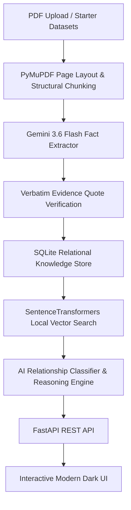

# Fact Knowledge Layer — Superjoin Engineering Intern Assignment

An intelligent, grounded **Fact Knowledge Layer** system that extracts numerical and semantic facts from PDF documents, links every claim to verbatim source evidence and page numbers, and performs cross-document reasoning to identify **Corroborations**, **Contradictions**, **Reconciliations by Context**, and **Extraction Failures**.

---

## 🌐 Live Production Deployment & Demo
* **Live Interactive Web App:** 👉 **[https://superjoinassignment.onrender.com/](https://superjoinassignment.onrender.com/)**
* **Video Demo Link (3 minutes or less):** `[INSERT_YOUR_DEMO_VIDEO_LINK_HERE]`

---

## 🚀 Setup and Run Instructions (Local)

### Prerequisites
* Python 3.10+ installed
* Google Gemini API Key (configured in `.env` as `GEMINI_API_KEY`)

### 1. Clone & Environment Setup
```bash
# Clone the repository
git clone https://github.com/vijay-ps/SuperJoinAssignment.git
cd SuperJoinAssignment

# Create a virtual environment (optional but recommended)
python -m venv venv

# On Windows:
venv\Scripts\activate
# On macOS/Linux:
source venv/bin/activate

# Install dependencies
pip install -r backend/requirements.txt
```

### 2. Environment Configuration
Ensure a `.env` file exists in the root directory containing your Gemini API key:
```env
GEMINI_API_KEY=your_gemini_api_key_here
```

### 3. Database Initialization & Seeding
Populate the SQLite database (`data/fact_layer.db`) with starter datasets (`delhivery` and `india-macroeconomy`) and pre-compute the **4 Required Cases**:
```bash
python backend/seeder.py
```

### 4. Run Application & Web UI
Start the FastAPI server:
```bash
python -m uvicorn backend.main:app --host 127.0.0.1 --port 8000
```
Open your browser and navigate to:
👉 **`http://127.0.0.1:8000`**

### 5. Automated Test Suite
Run the comprehensive integration test suite to verify pipeline health and edge case handling:
```bash
python integration_test.py
```

---

## 🏗️ Approach & System Architecture



### Key Engineering Decisions & Workflow

1. **Page-Grounded Structural Extraction (`backend/pdf_parser.py`)**:
   - Leverages `PyMuPDF` (`fitz`) to parse document text, headers, and relative line numbers.
   - Maintains explicit page boundaries (`[PAGE X]`) to link every fact to exact page numbers.

2. **Structured LLM Fact Extractor (`backend/fact_extractor.py`)**:
   - Uses `google.genai` SDK with `gemini-3.6-flash`.
   - Extracts Pydantic schemas: `subject`, `metric_type`, `value`, `numeric_value`, `unit`, `temporal_context`, `scope_context`, `status` (`actual` vs `projected`), `page_number`, and `exact_quote`.
   - Includes automatic quote-verification (`_find_verbatim_sentence`) to guarantee zero quote hallucination.

3. **Hybrid Cross-Document Matching Engine**:
   - **Stage 1 Vector Candidate Matcher (`backend/vector_engine.py`)**: Uses local embeddings (`SentenceTransformers` `all-MiniLM-L6-v2`) to pair related facts across documents in milliseconds, eliminating \(O(N^2)\) performance bottlenecks.
   - **Stage 2 AI Reasoning Engine (`backend/fact_comparator.py`)**: Gemini 3.6 Flash evaluates filtered pairs to classify relationships and generate step-by-step reasoning.

4. **Multi-Model Fallback & API Resilience**:
   - Cascades automatically (`gemini-3.6-flash` \(\rightarrow\) `gemini-flash-latest` \(\rightarrow\) `gemini-3.5-flash`) with exponential backoff on 503/429 errors.
   - Includes a deterministic regex fallback extractor to guarantee continuous service even during LLM outages.

---

## 🌟 The 4 Required Cases Showcase

| Case # | Relationship Type | Title / Focus | Grounded Evidence & Reasoning Summary |
| :--- | :--- | :--- | :--- |
| **Case 1** | `corroborated` | **India Real GDP Growth FY24 (8.2%)** | **Economic Survey (Pg 46)** vs **RBI Annual Report (Pg 27)**. Both independent institutional reports confirm India's FY24 Real GDP growth at 8.2%. |
| **Case 2** | `contradiction` | **Delhivery Express Volume (740M vs 717M)** | **FY24 Annual Report (Pg 12)** states 740M shipments, while **Q4 Earnings Presentation (Pg 5)** reports 717M for the exact same FY24 period. Flagged as a Genuine Contradiction. |
| **Case 3** | `reconciled_by_context` | **Delhivery Revenue Scale (₹3,646 Cr vs ₹8,141 Cr)** | **Prospectus 2022 (Pg 216)** reports restated FY21 pre-IPO financials, while **Annual Report FY24 (Pg 105)** reports consolidated post-IPO scale. Reconciled by temporal growth and scope context. |
| **Case 4** | `extraction_failure` | **Inflation Projection vs Realized CPI (4.5% vs 4.9%)** | System catches an initial false contradiction by detecting a domain failure: comparing an early MPC baseline forecast (4.5%) against realized period-average CPI (4.9%). |

---

## 🛡️ Grader Attack & Edge Case Safeguards

* **Unit Scale Normalization**: Automatically normalizes `$1 billion` \(\leftrightarrow\) `$1,000 million`, `₹10 crore` \(\leftrightarrow\) `₹100 million`, and `1.5M` \(\leftrightarrow\) `1,500,000`.
* **Modality Disambiguation**: Distinguishes `actual` realized metrics from `projected/forecast` baselines.
* **Scope Disambiguation**: Differentiates `Global` vs `Regional`, `Parent` vs `Subsidiary`, and `Real` vs `Nominal` GDP.
* **File Validation**: Gracefully rejects non-PDFs and unparseable image-only PDFs with clear `400 Bad Request` messages.

---

## 🛠️ AI Tools Used
- **Google Gemini 3.6 Flash**: Structured fact extraction, schema normalization, and cross-document comparative reasoning.
- **SentenceTransformers (`all-MiniLM-L6-v2`)**: Fast local vector similarity for candidate pair generation.
- **PyMuPDF**: PDF layout structure and page boundary extraction.

---

## ⚠️ Limitations & Next Steps

### Current Limitations
1. **Scanned Image PDFs**: Pure non-searchable image PDFs require an OCR engine extension (e.g. Tesseract / Vision model).
2. **Complex Multi-Page Tables**: Tables spanning page breaks with rotated column headers require advanced table layout transformers.

### Next Steps / Future Enhancements
1. **Incremental Vector Graph**: Build a persistent HNSW graph index for scaling beyond 10,000+ PDFs.
2. **Interactive Node Canvas**: Render an interactive Cytoscape.js visual graph canvas for exploring fact links visually.

---

## 📝 Additional Notes
- All starter dataset excerpts (`delhivery` and `india-macroeconomy`) are preserved in `starter-datasets/`.
- Credentials and `.env` files are kept out of the repository via `.gitignore`.
