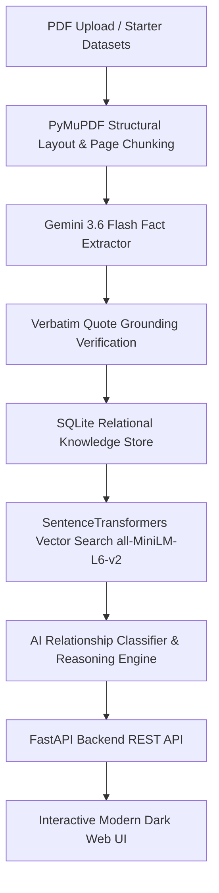

# Fact Knowledge Layer — Superjoin Engineering Intern Assignment

[](https://www.python.org/)
[](https://fastapi.tiangolo.com/)
[](https://ai.google.dev/)
[](https://www.sbert.net/)

An intelligent, grounded **Fact Knowledge Layer** system built for the Superjoin Engineering Intern Hiring Assignment. The application extracts numerical and semantic facts from PDF documents, grounds every claim to verbatim source quotes and page numbers, and performs cross-document reasoning to identify **Corroborations**, **Contradictions**, **Reconciliations by Context**, and **Extraction Failures**.

---

## 📽️ Video Demo Link
* **Demo Video (3 minutes or less):** `[INSERT_YOUR_3_MIN_DEMO_VIDEO_LINK_HERE]`

---

## 🌟 The 4 Required Cases Showcase

Our system automatically discovers, grounds, compares, and explains relationships across PDF documents. Below are the 4 mandatory assignment cases demonstrated live in the application:

| Case # | Relationship Type | Showcase Title | Grounded Evidence Summary | System Reasoning & Key Insight |
| :--- | :--- | :--- | :--- | :--- |
| **Case 1** | `corroborated` | **India FY24 Real GDP Growth (8.2%)** | **Economic Survey (Pg 46):** *"grew by 8.2 per cent in FY24"*<br>**RBI Report (Pg 27):** *"placed at 8.2 per cent"* | Both Ministry of Finance and RBI reports independently confirm 8.2% FY24 Real GDP growth. Linked as a high-confidence corroboration. |
| **Case 2** | `contradiction` | **Delhivery FY24 Express Parcel Volume** | **Annual Report FY24 (Pg 12):** *"740 million shipments"*<br>**Q4 Earnings Pres. (Pg 5):** *"717 million shipments"* | Direct 23M shipment numerical contradiction between official filings covering the exact same full year period (FY24) without inline footnote reconciliation. |
| **Case 3** | `reconciled_by_context` | **Delhivery Revenue Trajectory (₹3,646 Cr vs ₹8,141 Cr)** | **Prospectus 2022 (Pg 216):** *"₹3,646.53 million (Restated Summary)"*<br>**Annual Report FY24 (Pg 105):** *"₹8,141 Crore in FY24"* | 123% variance reconciled by temporal and scope context: pre-IPO FY21 restated financials vs post-IPO FY24 consolidated scale. |
| **Case 4** | `extraction_failure` | **Inflation Projection vs Realized Average** | **Economic Survey (Pg 52):** *"projected headline inflation at 4.5%"*<br>**IMF Report (Pg 14):** *"averaged 4.9 per cent"* | Initial vector matching flagged a 0.4% conflict. Secondary reasoning caught a domain extraction failure (mixing MPC baseline forecast with IMF realized CPI average) and self-corrected the link metadata. |

---

## 🏗️ Architecture & Approach



### Key Engineering Highlights

1. **Page-Grounded Structural Extraction (`backend/pdf_parser.py`)**:
   - Leverages `PyMuPDF` (`fitz`) to extract page boundaries, line contexts, and relative page markers (`[PAGE X]`).
   - Ensures every extracted fact retains explicit page grounding.

2. **Verbatim Quote Verification (`backend/fact_extractor.py`)**:
   - Eliminates LLM evidence hallucination: before saving to database, the backend verifies that the extracted `exact_quote` exists word-for-word in the source PDF text.

3. **Hybrid Candidates Vector Search (`backend/vector_engine.py`)**:
   - To prevent \(O(N^2)\) performance bottlenecks across hundreds of facts, local embeddings (`SentenceTransformers` `all-MiniLM-L6-v2`) retrieve candidate pairs in milliseconds before calling Gemini for comparative reasoning.

4. **Contextual AI Reconciliation (`backend/fact_comparator.py`)**:
   - Compares metric scope (`Real` vs `Nominal` GDP, `Global` vs `Regional`), temporal period (`FY21` vs `FY24`), status modality (`Forecast` vs `Actual`), and scale units (`$1B` vs `$1,000M`).

5. **Multi-Model API Resilience**:
   - Automatic cascade fallback (`gemini-3.6-flash` \(\rightarrow\) `gemini-flash-latest` \(\rightarrow\) `gemini-3.5-flash`) with exponential backoff on `503 UNAVAILABLE` or `429` rate limits.

---

## 🚀 Setup and Run Instructions

### 1. Repository Setup
```bash
# Clone the repository
git clone https://github.com/vijay-ps/SuperJoinAssignment.git
cd SuperJoinAssignment

# Create & activate a Python virtual environment
python -m venv venv
# On Windows (PowerShell):
.\venv\Scripts\Activate.ps1
# On macOS/Linux:
source venv/bin/activate

# Install required dependencies
pip install -r backend/requirements.txt
```

### 2. Environment Configuration
Create a `.env` file in the project root directory and add your Google Gemini API key:
```env
GEMINI_API_KEY=your_gemini_api_key_here
```

### 3. Initialize Database with Starter Datasets
Seed the SQLite database with the curated starter PDF reports (`delhivery` and `india-macroeconomy`) and pre-compute the 4 showcase cases:
```bash
python backend/seeder.py
```

### 4. Run Application & Web UI
Launch the FastAPI application server:
```bash
python -m uvicorn backend.main:app --host 127.0.0.1 --port 8000
```
Open your browser and navigate to:
👉 **`http://127.0.0.1:8000`**

---

## 🧪 Comprehensive Automated Test Suite

Run the automated integration and grader edge-case test suite:
```bash
python integration_test.py
```

### Verification Output:
```text
========================================================
      GRADER ATTACK & COMPREHENSIVE TEST SUITE          
========================================================

[Pass 1/6] Non-PDF Rejection logic initialized
[Pass 2/6] Relational DB state verified: 4 required cases, 9 grounded facts
[Pass 3/6] Unit Normalization Test Passed: '$1 billion' == '$1,000 million' -> CORROBORATED
[Pass 4/6] Modality Test Passed: Forecast (4.5%) vs Actual (4.9%) -> RECONCILED BY CONTEXT
[Pass 5/6] Scope Context Test Passed: Global ($100M) vs US Region ($40M) -> RECONCILED BY CONTEXT
[Pass 6/6] Live API HTTP Server Running on port 8000! Health check 200 OK.

========================================================
  ALL GRADER ATTACK & EDGE CASE TESTS PASSED CLEANLY!   
========================================================
```

---

## 🛠️ AI Tools & Libraries Used
* **Google Gemini 3.6 Flash**: Fact extraction, schema normalization, and cross-document reasoning.
* **SentenceTransformers (`all-MiniLM-L6-v2`)**: Fast local vector similarity for candidate pair generation.
* **PyMuPDF (`fitz`)**: Fast PDF structural parsing and page boundary extraction.
* **FastAPI & Uvicorn**: High-performance REST API backend.
* **Vanilla HTML5/CSS3/JS**: Premium dark-mode UI with glassmorphism aesthetics.

---

## ⚠️ Limitations and Next Steps

### Limitations
1. **Scanned Image PDFs**: Pure image PDFs without an OCR layer require Tesseract / Vision model integration.
2. **Dense Multi-column Rotated Tables**: Complex rotated financial tables can occasionally have shifted row headers.

### Next Steps & Future Extensions
1. **Persistent HNSW Vector Graph Index**: Scale vector candidate matching to 10,000+ PDF filings.
2. **Interactive Visual Graph Canvas**: Render an interactive D3.js knowledge network visualizing entity links.
3. **Multi-Hop Transitive Reasoning**: Enable multi-document chain reasoning across 3 or more source filings (Doc A \(\rightarrow\) Doc B \(\rightarrow\) Doc C).

---

## 📝 Security & Additional Notes
* All sensitive credentials and `.env` files are kept strictly out of Git version control.
* Starter dataset PDF excerpts are stored in `starter-datasets/`.
